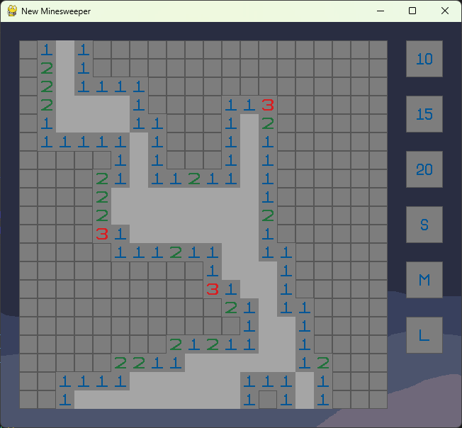

# Mine Sweeper

This version is not a perfect clone of the original game: the grid size options, bomb density options, and graphics are not the same.

The rules are almost the same as the original, with the exception that you cannot "quick click" in this version ("quick click" being when you can click on a number to reveal all neighbouring tiles that do not have flags on them).

Several years ago I produced a version of Mine Sweeper that had no size buttons or density buttons. The old version was not made with classes, so I made it from scratch using them.

## How to Run the Code

`Mine_Sweeper.py` is the main program and is the file to run.

All of the following files must be in the same folder in order to run:

- `assets`
- `asset_names_and_locations.txt`
- `field_module.py`
- `keyboard.py`
- `Mine_Sweeper.py`
- `mine_Sweeper_module.py`
- `mouse.py`

## Controls

- **left click** - reveals the square.
- **right click** - toggles a flag on/off an unrevealed square.
- **R** - resets the grid.
- **C** - toggles a cheat that reveals/hides the entire grid.
- **Q** - ends the game loop.
- **S** - snaps the size of the window to perfectly contain the grid with a tile-wide border.
- **F** - snaps the size of the window to perfectly fill the monitor (by "fill the monitor", I mean 1920 x 1080; it will not adjust for any monitor size).

Note that while **"S"** and **"F"** change the size of the window, the window can still be resized manually.

## Buttons

There are 6 buttons in the game, three for size and three for bomb density.

Clicking a button does not immediately apply the selected setting.

To apply the new setting, press **R** to reset the grid. The new settings will then be used.

## Technical Info

The graphics were all made using **GIMP 2.10.34**.

The code is all written in **Python 3.11 (64-bit)**.

The only required external library is **Pygame**. The other libraries used (`math`, `os`, and `random`) are included with Python.

Note that Pygame can be installed using the command "pip install pygame" in a terminal or command prompt.

The assets are determined by the file paths given in `asset_names_and_locations.txt`.

An executable version of the code can be produced using auto-py-to-exe: https://github.com/brentvollebregt/auto-py-to-exe

Note that such an executable file is not available here.
